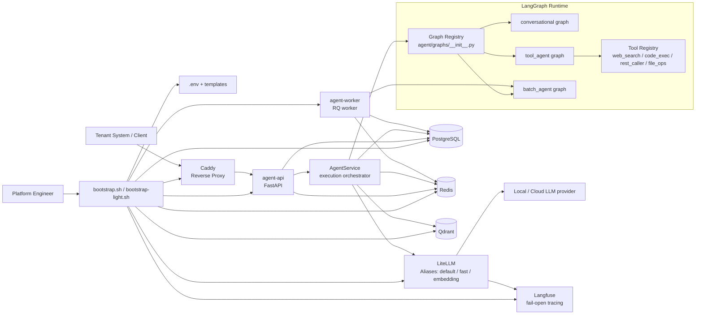

# 2brain Architecture

This document reflects the current implemented runtime around `agent-api`, `agent-worker`, LiteLLM routing, and the LangGraph-based execution pipeline.

## Runtime Flow

1. A tenant system calls `POST /api/v1/run` or `POST /api/v1/jobs`.
2. `api/deps.py` authenticates `X-API-Key` and resolves the active `tenant`.
3. `agent/service.py` loads the `agent_definition`, picks the `graph_type`, and prepares the shared `AgentState`.
4. The selected graph executes through LiteLLM aliases (`default`, `fast`, `embedding`), optionally using tools, session state, memory, or the async worker path.
5. Structured logs and traces are emitted without blocking the runtime.

## What Is the Agent Graph?

The **agent graph** is the executable workflow that turns an input into a response.
It is not just the model call: it is the state machine that decides how the agent should behave step by step.

In 2brain, the graph is responsible for things like:
- carrying shared execution state (`tenant_id`, `session_id`, `_model_alias`, tool events)
- deciding whether the run is conversational, tool-using, or batch-oriented
- invoking LiteLLM with aliases only
- coordinating tool calls and future HITL interrupts/resume points

### Registered Graph Types

| `graph_type` | File | Primary use | Behavior |
|---|---|---|---|
| `conversational` | `agent/graphs/conversational.py` | sync/session chat | builds message history and returns one LLM answer |
| `tool_agent` | `agent/graphs/tool_agent.py` | tool-enabled tasks | loops over tool calls, executes allowlisted tools, then synthesizes an answer |
| `batch_agent` | `agent/graphs/batch_agent.py` | async / backend-style jobs | runs batch-style processing with the same alias-only LLM contract |

> In short: **`AgentService` is the orchestrator; the agent graph is the workflow it executes.**

## Component Map

| Component | Main files | Responsibility |
|---|---|---|
| API surface | `api/routes/*.py` | request validation, auth, HTTP contract |
| Orchestration | `agent/service.py` | load definitions, select graph, prepare state |
| Graph runtime | `agent/graphs/*.py` | actual execution workflow |
| LLM routing | `agent/llm.py`, `infra/litellm/*.template` | alias-only model calls and fallback |
| Session / queue | `agent/session_store.py`, `worker/queue.py` | conversational persistence and async jobs |
| Policies / observability | `agent/policy.py`, `agent/observability.py` | guardrails and tracing |

## ADR Summary

The main implementation decisions have been reconstructed as ADRs in [`docs/adrs.md`](adrs.md).

| ADR | Decision |
|---|---|
| `ADR-001` | Self-hosted single-host deployment on Docker Compose |
| `ADR-002` | `tenant` is the isolation boundary (not `client`) |
| `ADR-003` | Thin FastAPI routes + centralized `AgentService` orchestration |
| `ADR-004` | Separate LangGraph workflows for conversational, tool, and batch execution |
| `ADR-005` | LiteLLM alias-only routing with `default -> fast` fallback |
| `ADR-006` | Redis + RQ for runtime state, PostgreSQL as durable source of truth |
| `ADR-007` | Per-tenant memory isolation in Qdrant / Mem0 |
| `ADR-008` | Fail-open observability and policy integration |
| `ADR-009` | Tool access controlled by per-agent allowlists and HITL hooks |
| `ADR-010` | Idempotent bootstrap and upgrade path, including the `clients -> tenants` migration |
